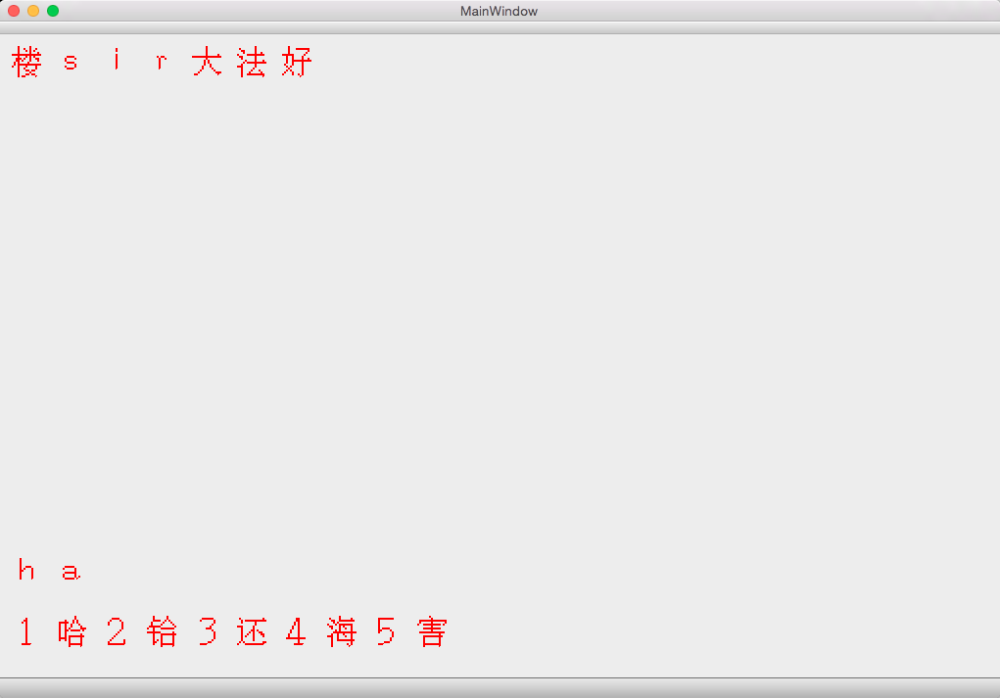

#Chinput

####李奥 3130001009 hi@leeleo.me

###程序简介

- 本程序是一个汉字编辑器（集成了输入法），使用了最新的哲标汉字编码，每个汉字使用16位无符号整形表示
- 整个程序界面分为上下两个部分，分别为编辑区与输入区
- 编辑区编辑文字，输入区输入拼音筛选文字

###程序亮点

- 使用了当今世界上最为先进的由浙江大学楼sir领导下的哲标码对汉字进行统一编码
- 完善的输入法功能，友好又简介的界面
- 横跨windows，linux， os x三大平台

###程序截图

- 输入界面

